# 🏗 AWS Custom VPC for a Multi-Tier Web Application

This project demonstrates the design and deployment of a *custom Virtual Private Cloud (VPC)* on AWS to host a *multi-tier web application*, using only the AWS Management Console.  
It's part of a beginner-level hands-on capstone project to apply AWS core services.

---

## 🖼 Architecture Diagram

---

## 📐 Architecture Overview

- Custom VPC with CIDR block: 10.0.0.0/16
- 2 Public Subnets: 10.0.10.0/24, 10.0.20.0/24
- 2 Private Subnets: 10.0.100.0/24, 10.0.200.0/24
- Internet Gateway (IGW)
- 2 NAT Gateways (each in a public subnet with EIP)
- 2 EC2 Instances (Web_Server1, Web_Server2) in Private Subnets
- IAM Role (ec2tossm) to allow SSM access
- Application Load Balancer (WebALB)
- Target Group (WebTG) with EC2 instances registered
- Auto Scaling Group (ASG) with Launch Template
- Security Groups (WebSG, ALBSG)

---

## 🧱 AWS Services Used

- Amazon VPC (with Subnets & Route Tables)
- Internet Gateway & NAT Gateways
- Elastic IPs
- Amazon EC2 (t2.micro, Amazon Linux 2023)
- IAM Roles (for SSM access)
- AWS Systems Manager (SSM Session Manager)
- Application Load Balancer (ALB)
- Target Group & Health Checks
- Auto Scaling Group with Launch Template
- Security Groups

---

## 📸 Deployment Steps & Screenshots

Below are the main deployment steps with corresponding screenshots from the AWS Console.

### 1️⃣ VPC Creation
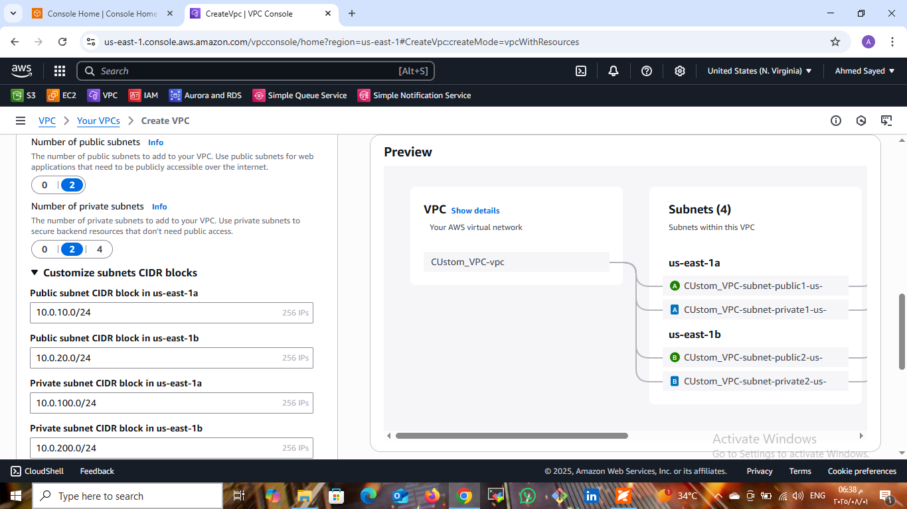  
Custom VPC created with CIDR 10.0.0.0/16 and subnets CIDR ranges defined.

### 2️⃣ Public Route Table
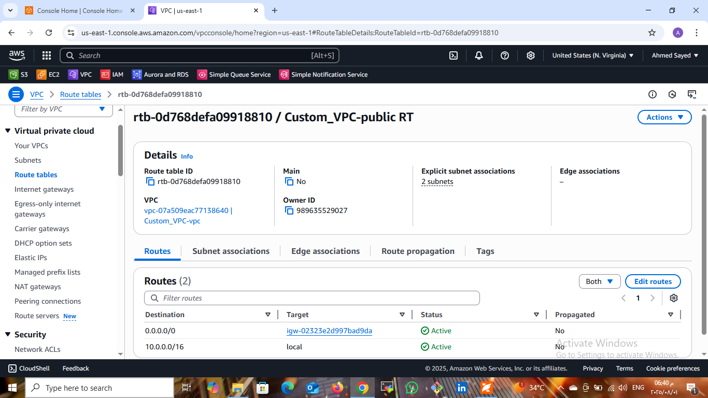  
Public Route Table with route to Internet Gateway.

### 3️⃣ NAT Gateway A Creation
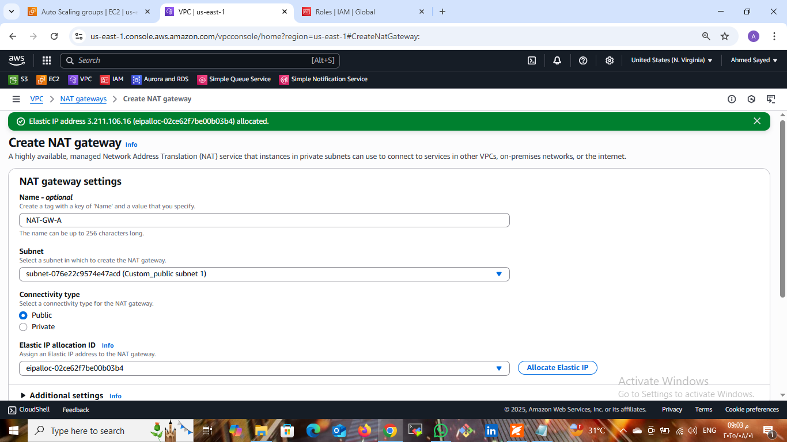  
NAT Gateway A created in the first public subnet.

### 4️⃣ Private Route Table
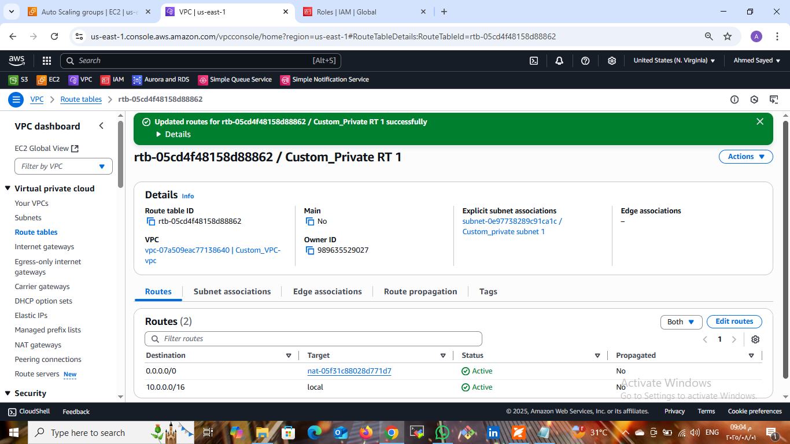  
Private Route Table configured to send internet-bound traffic through NAT Gateway.

### 5️⃣ Web Server 1 Details
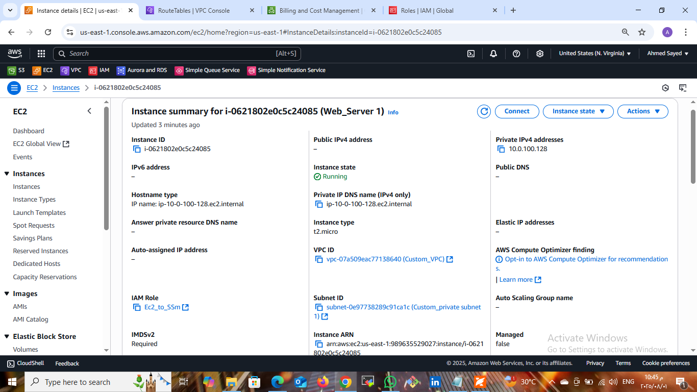  
Details of Web_Server1 instance including IAM role for SSM.

### 6️⃣ Web Server 2 Details
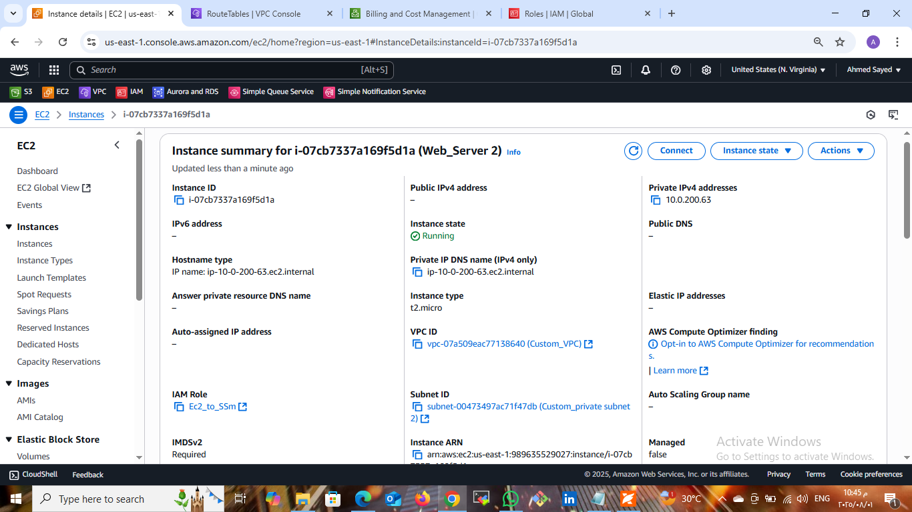  
Details of Web_Server2 instance including IAM role for SSM.

### 7️⃣ Web Server 1 Browser Test
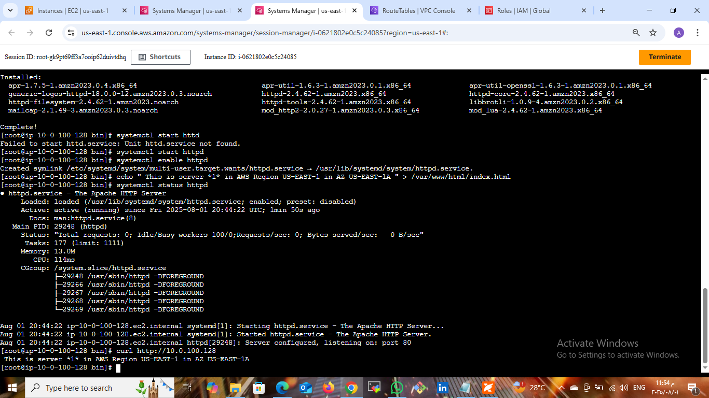  
Curl test to Web_Server1 private IP showing correct HTML output.

### 8️⃣ Web Server 2 Browser Test
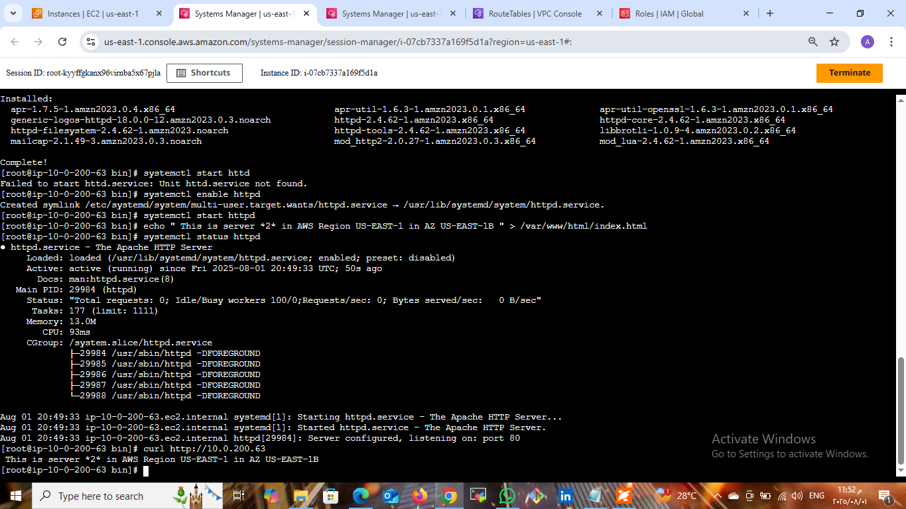  
Curl test to Web_Server2 private IP showing correct HTML output.

### 9️⃣ ALB Browser Test (Server 1)
  
Load Balancer directing traffic to Web_Server1.

### 🔟 ALB Browser Test (Server 2)
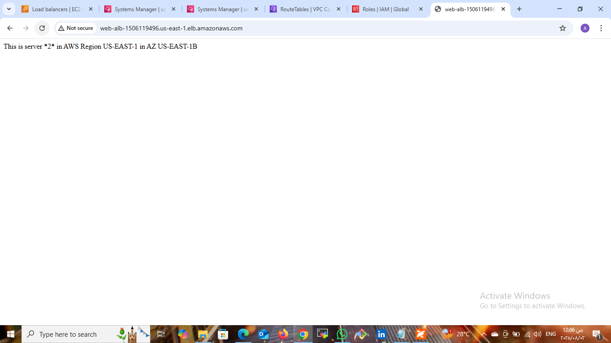  
Load Balancer directing traffic to Web_Server2.

### 1️⃣1️⃣ Target Group
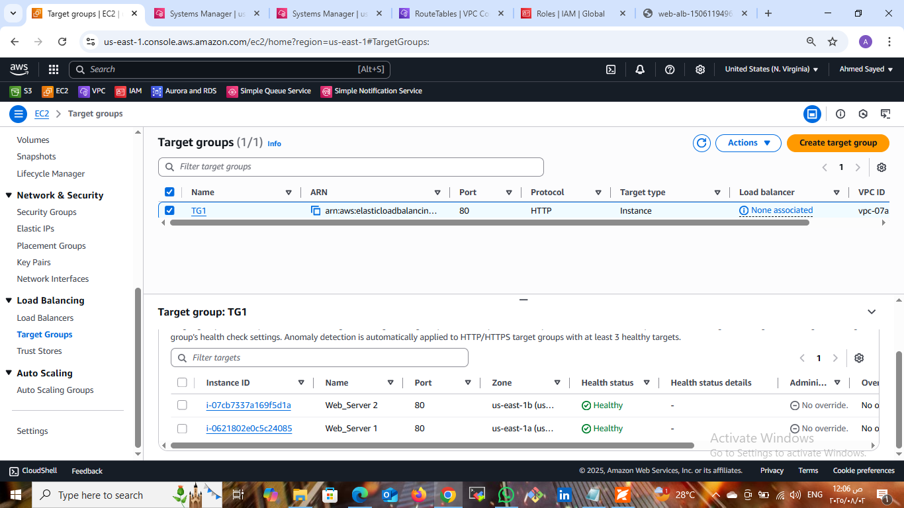  
Target Group with both web servers registered and healthy.

### 1️⃣2️⃣ Launch Template Creation
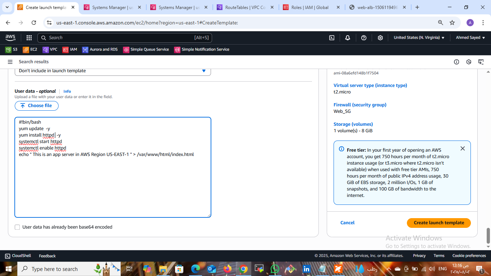  
Launch Template created for Auto Scaling Group.

### 1️⃣3️⃣ Auto Scaling Group Details
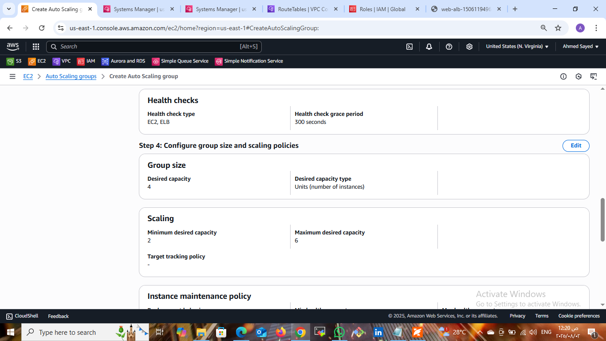  
Auto Scaling Group configured with manual scaling options.

### 1️⃣4️⃣ Auto Scaling Group Testing
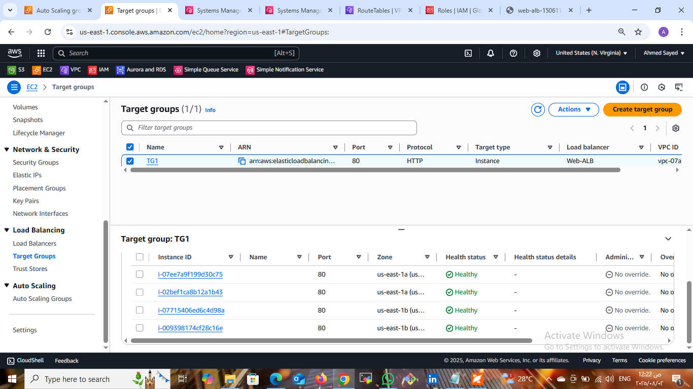  
ASG scaled up to 4 instances as per desired capacity.

### 1️⃣5️⃣ ALB Final Browser Test
  
ALB serving content from auto-scaled instances with message:  
This is an app server in AWS Region US-EAST-1

---

## 🌍 Final Result

After the ALB and ASG setup, the application is served securely from private EC2 instances via the ALB.  
Scaling is automatic and traffic is balanced between instances.

---

## 🔐 Security Configuration Summary

| Security Group | Inbound | Outbound |
|----------------|---------|----------|
| *WebSG*      | HTTP 80 from ALBSG | Allow all |
| *ALBSG*      | HTTP 80 from Anywhere | HTTP to WebSG |

---

## 🧹 Cleanup Steps

To avoid charges:
- Delete EC2 Instances and Auto Scaling Group
- Delete NAT Gateways and release Elastic IPs
- Delete ALB and Target Group
- Delete Internet Gateway and VPC

---

## 👨‍💻 Author

*Ahmed Sayed*  
Cloud & DevOps Enthusiast  
Student at Faculty of Engineering  
[LinkedIn Profile] (https://www.linkedin.com/in/ahmed-sayed-devops-cloud)

----------

## License
This project is licensed under the MIT License - see the [LICENSE](LICENSE) file for details.
